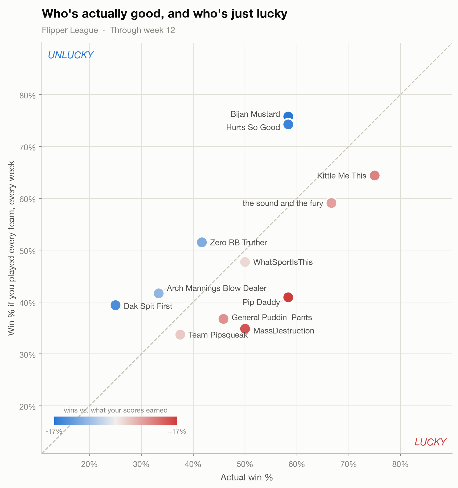
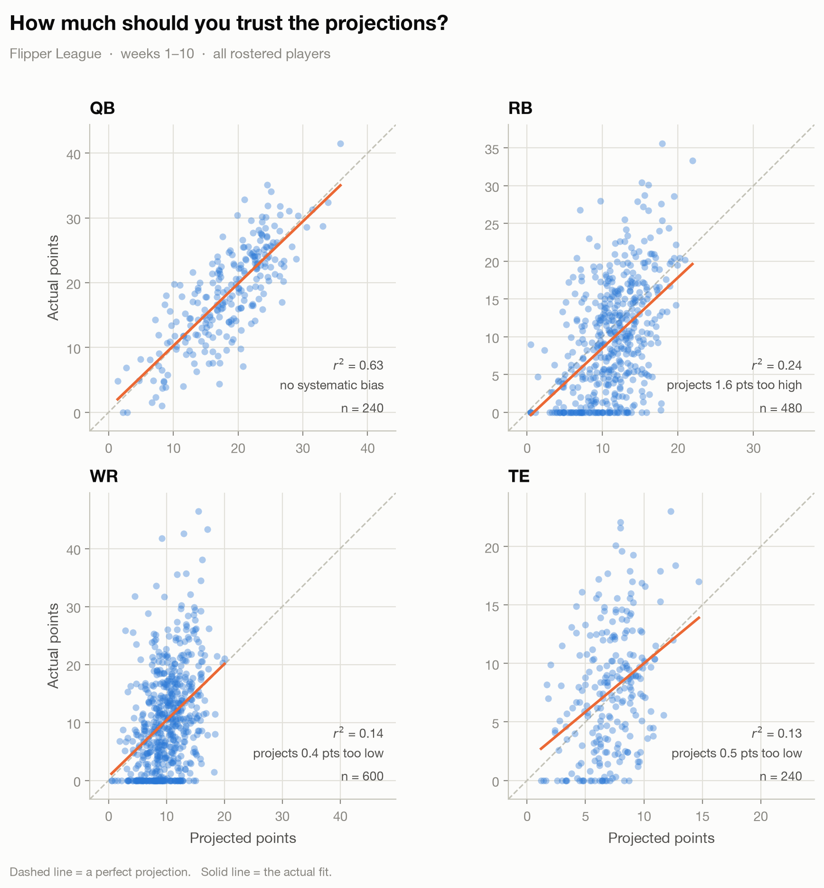

# espn_ff

Pull your ESPN fantasy football league out of the API and make charts from it.

Built for league hobbyists: clone it, drop in your credentials, run a script,
get a PNG you can paste into the league chat.



<sub>Example output, generated from a synthetic league.</sub>

## Setup

Needs Python 3.10 or newer.

```bash
git clone <this repo> && cd espn_ff

# with uv (fast)
uv venv && uv pip install -e .
source .venv/bin/activate

# or with plain pip
python3 -m venv .venv && source .venv/bin/activate
pip install -e .
```

Then copy the config template and fill it in:

```bash
cp config.ini.example config.ini
```

```ini
[espn]
swid     = {XXXXXXXX-XXXX-XXXX-XXXX-XXXXXXXXXXXX}
espn_s2  = AEB...
league_id = 123456
season    = 2025
```

**Where the credentials come from.** If your league is **public you can skip
this entirely** -- leave `swid` and `espn_s2` blank. For a private league, log
into fantasy.espn.com in Chrome, open DevTools (`Cmd-Opt-I` / `F12`) →
Application → Cookies → `https://fantasy.espn.com`, and copy the `SWID` and
`espn_s2` values. These are session cookies and expire every so often; if
scripts start failing with a 401, that's what happened -- paste in fresh ones.

`config.ini` is gitignored. Don't commit it.

**Your league ID** is in the URL when you're looking at your league:
`fantasy.espn.com/football/league?leagueId=123456`.

## Making a chart

```bash
python scripts/luck_chart.py
python scripts/luck_chart.py --week 9 --theme dark
python scripts/luck_chart.py --league-id 84667 --season 2024 --out old.png
```

Charts land in `output/`. Every script takes `--league-id`, `--season`, and
`--week` to override `config.ini`, so you can point at any league you can see
without editing anything.

### What's in here

| Script | Chart |
|---|---|
| `luck_chart.py` | Real win % vs. "what if you played every team every week" -- who's good and who's just been handed a soft schedule |
| `proj_vs_actual.py` | Projected vs. actual points, one facet per position -- how much ESPN's weekly projections are worth |



<sub>Example output, generated from a synthetic league.</sub>

```bash
python scripts/proj_vs_actual.py --start-week 1 --end-week 6
python scripts/proj_vs_actual.py --positions QB RB --started-only
```

This one makes **one request per week**, so the first run over a full
season takes a moment. After that it's served from the cache.

Two things worth knowing about how it counts:

- Position comes from the player's **real position**, not the lineup slot
  they were played in. Counting by slot would drop every bench player and
  label flex starters "Flex" -- and it would only ever sample players
  someone chose to start, which stacks the deck toward players who were
  expected to do well.
- Players who were rostered but scored 0 (inactive, injured, bye) are
  **included** by default. They're genuine projection misses, but they're a
  different kind from "played and underperformed," and they show up as a
  band along the bottom of each facet. Use `--started-only` to see just the
  players managers actually trusted that week.

## Using it from a notebook

The library is the useful part; the scripts are just thin wrappers. Every
chart function returns a matplotlib figure, so it works inline:

```python
from espn_ff import League, analysis, config
from scripts.luck_chart import make_chart

cfg = config.load()
league = League(cfg.league_id, cfg.season, swid=cfg.swid, espn_s2=cfg.espn_s2)

schedule = league.schedule()
table = analysis.records(schedule, through_week=9)
table[["name", "wins", "losses", "win_pct", "all_play_pct", "luck"]]

make_chart(table, week=9)
```

### The API wrapper

```python
league.teams()          # one row per team: record, points, final rank
league.schedule()       # one row per matchup, all season, scores included
league.rosters(week=3)  # every rostered player, projected vs. actual points
league.rosters_range(range(1, 10))   # several weeks, stacked
league.raw(["mTeam"])   # raw JSON, for anything the above doesn't cover
```

Responses are cached in `.cache/`, so re-running a script or iterating on
analysis in a notebook doesn't re-hit ESPN. Pass `--refresh` (or
`refresh=True`) when you want fresh data -- during a live week, for example.

### Analysis helpers

```python
analysis.records(schedule, through_week=9)   # real + all-play records, luck
analysis.weekly_scores(schedule)             # one row per team per week
analysis.team_games(schedule, team_id=4)     # one team's season, their POV
analysis.projection_accuracy(rosters)        # r2 / bias / MAE per position
analysis.projection_error(rosters)           # the filtered rows behind it
```

## Notes on the ESPN API

It's undocumented, so here's what this repo has learned the hard way:

- The read host moved to `lm-api-reads.fantasy.espn.com` in **April 2024**.
- Seasons before **2018** are only reachable through the `leagueHistory`
  endpoint, which wraps its response in a list. `League` handles this for you.
- Data is selected with repeated `view` parameters (`mTeam`, `mMatchup`,
  `mMatchupScore`, `mRoster`, `mBoxscore`). Passing them in a plain dict
  silently keeps only the last one -- they have to be a list.
- In player stats, `statSourceId` `0` is **actual** and `1` is **projected**.
- `lineupSlotId` and `proTeamId` are integer codes; see `espn_ff/constants.py`.
- `lineupSlotId` is the slot a player was **played in**; `defaultPositionId`
  is their actual position. You almost always want the latter.
- Roster data is per-week: you have to pass `scoringPeriodId` and make one
  request per week you want.
- D/ST entries have no `injuryStatus` key at all, unlike every other player.
- Leagues with an odd number of teams have bye matchups with only one side.

## Adding a chart

1. Add a parse method to `League` only if the data isn't reachable yet.
2. Put any real calculation in `analysis.py` so it's reusable and testable --
   not buried in the plotting code.
3. Copy `scripts/luck_chart.py`: a `make_chart(...) -> fig` function, and a
   `main()` that parses args and saves. Call `viz.use_theme()` first and draw
   with the palette it returns, so every chart in the repo matches.
